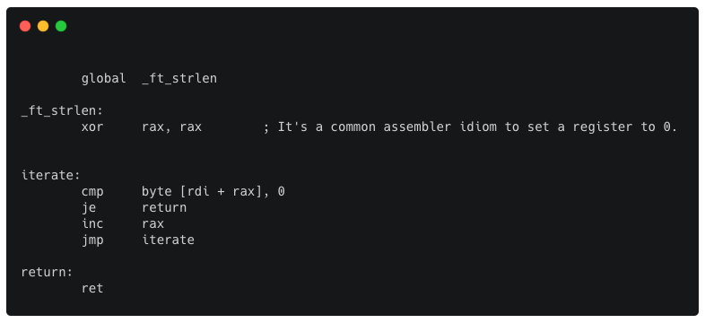

# Libasm
The aim of this project is to get familiar with assembly language.



# The language
An assembly language is a low-level programming language designed for a specific type of processor.
<br />It describes the succession of commands your processor will execute. One line means one instruction. 
</br >Most programs consist of **directives** followed by one or more **sections**. Lines can have an optional **label**. Most lines have an **instruction** followed by zero or more **operands**.<br />The assembly language is a language in which there is a very strong correspondence between the instructions in the language and the architecture's machine code instructions. I highly recommend this article [here!](https://medium.com/a-42-journey/a-quick-guide-to-code-your-first-assembly-functions-43c2032ebfda)

# General
The project contains basic functions in Assembly using the x86_64 architecture.
  - `ft_strlen`
  - `ft_strcpy`
  - `ft_strcmp`
  - `ft_write`
  - `ft_read`
  - `ft_strdup`
  -  *and more...*

# Setup
```
$ git clone git@github.com:kamilprzybyl/Libasm.git
$ cd Libasm
$ make
```
### Testing
```
make test
./test
```

</br >

###### :bulb: To better understand this project check *Libasm.pdf* file
